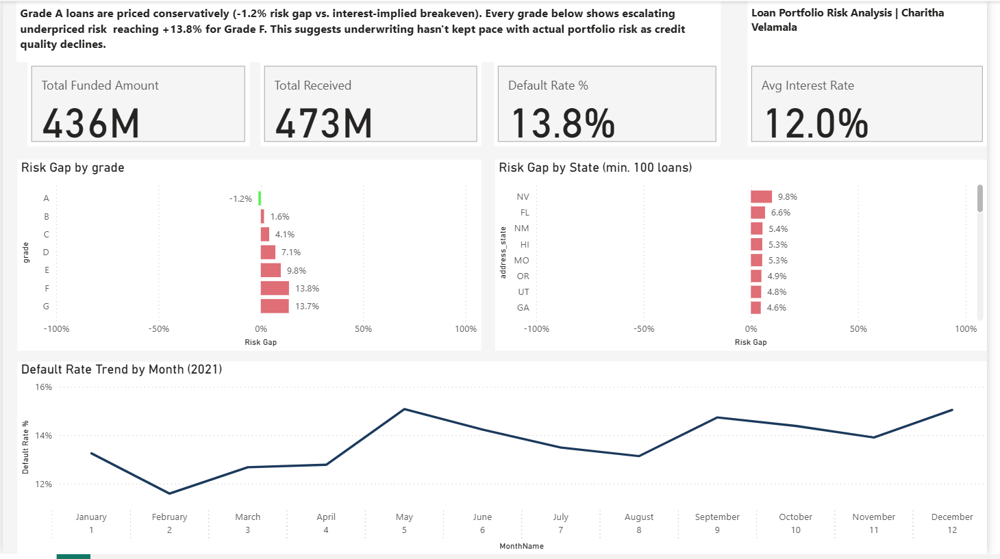

# Loan Portfolio Risk Mispricing Dashboard

A Power BI dashboard analyzing whether loan grades are priced appropriately for the risk they carry, using a real bank loan dataset (~38,500 loans issued in 2021).



## The Question

Loan grades (A through G) are supposed to reflect risk, and interest rates are supposed to price that risk in. But does the *actual* default rate match what the interest rate implies the bank expects to lose? This dashboard tests that assumption directly from the data rather than relying on external benchmarks.

## Key Insight

**Grade A loans are priced conservatively — every grade below it is progressively underpriced for risk.**

| Grade | Avg Interest Rate | Actual Default Rate | Interest-Implied Breakeven Rate | Risk Gap |
|-------|-------------------|----------------------|----------------------------------|----------|
| A | 7.35% | 5.70% | 6.85% | **-1.2%** |
| B | 11.03% | 11.50% | 9.93% | +1.6% |
| C | 13.55% | 16.02% | 11.93% | +4.1% |
| D | 15.71% | 20.69% | 13.58% | +7.1% |
| E | 17.71% | 24.80% | 15.04% | +9.8% |
| F | 19.74% | 30.25% | 16.49% | +13.8% |
| G | 21.40% | 31.31% | 17.63% | +13.7% |

The gap widens almost linearly from B to F, meaning the portfolio's underwriting hasn't kept pace with actual credit risk as grade quality declines.

## Methodology

Rather than using arbitrary or externally-sourced default rate benchmarks, this project derives an **interest-rate-implied breakeven default rate**: the default rate at which a loan's interest premium would just cover the expected loss, assuming full loss on default.

```
Breakeven Default Rate = Interest Rate / (1 + Interest Rate)
Risk Gap = Actual Default Rate − Breakeven Default Rate
```

This is a simplified model (it doesn't account for partial recovery/LGD or time value of money), but it ties the analysis directly to observable pricing decisions in the data rather than assumed constants.

## Dashboard Components

- **KPI row:** Total Funded Amount, Total Received, Overall Default Rate, Avg Interest Rate
- **Risk Gap by Grade:** diverging bar chart, the core analytical visual
- **Risk Gap by State (min. 100 loans):** geographic breakdown, filtered to exclude low-volume states where the rate would be noisy
- **Default Rate Trend by Month (2021):** monthly seasonality within the single-year dataset

## Data

Dataset: ~38,576 loan records (`financial_loan.xlsx`), covering loan amount, term, interest rate, grade/sub-grade, borrower income, loan status, purpose, state, and issue date. All loans were issued within 2021.

The raw dataset is not included in this repo (out of respect for the original source's attribution) — it can be found at [(https://github.com/kirti2222/Python-Project/blob/main/financial_loan.xlsx)]. Download it separately to reproduce this analysis.

## Tools

- Power BI Desktop (Power Query for cleaning, DAX for measures)
- Core DAX measures: `Total Funded Amount`, `Default Rate %`, `Expected Default Rate` (dynamic, interest-rate-based), `Risk Gap`

## Key DAX

```dax
Default Rate % =
DIVIDE(
    CALCULATE(COUNTROWS(financial_loan), financial_loan[loan_status] = "Charged Off"),
    [Loan Count]
)

Expected Default Rate =
VAR AvgRate = AVERAGE(financial_loan[int_rate])
RETURN DIVIDE(AvgRate, 1 + AvgRate)

Risk Gap = [Default Rate %] - [Expected Default Rate]
```

## Notes on Data Quality

- Excluded `application_type` (single value across all rows) and `emp_title` (too many unique values to be analytically useful)
- Filtered the state-level breakdown to states with more than 100 loans to avoid small-sample noise
- All loans in this dataset were issued in 2021, so the "monthly trend" reflects seasonality within that single year, not a multi-year trend

---

*Built by Charitha Velamala as a portfolio project.*
